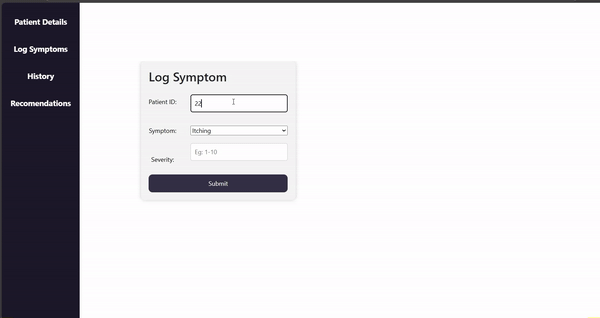

# Patient Symptom Tracker

## Overview
A simple application that allows patients to log and track their daily symptoms, view symptom history in a graph, and receive basic health recommendations.




## Features
- **Log Symptoms**: Patients can record daily symptoms with severity ratings.
- **View History**: Symptom history is displayed in an easy-to-understand graph(LINE GRAPH) and also Symptom wise graph(BAR GRAPH) can also be viewed.
  Plotted against DateTime and Severity of the symptom.
- **Health Recommendations**: ML model is used to predict the plausible disease pertaining to the patient using the recent symptoms and recommendations are provided based on the disease.

##Technology stack
-Python(FLask)
-HTML & CSS
-MYSQL

## Setup Instructions
1. **Clone the Repository**:
   ```bash
   git clone https://github.com/theeran-ak/PatientSymptomTracker.git
2. **Install Dependencies**
   ```bash
   pip install -r requirements.txt
3. **MYSQL SETUP**
   --In app.py, generate_image.py, get_recommendations.py change the password
   **SCHEMA**
   ```bash
      CREATE TABLE `patientdetails` (
     `p_id` int NOT NULL,
     `p_name` varchar(30) DEFAULT NULL,
     `age` int DEFAULT NULL,
     `contact` varchar(10) DEFAULT NULL,
     PRIMARY KEY (`p_id`)
     )
   
      CREATE TABLE `log` (
     `p_id` int DEFAULT NULL,
     `logdate` datetime DEFAULT CURRENT_TIMESTAMP,
     `symptom` varchar(20) DEFAULT NULL,
     `severity` int DEFAULT NULL,
     KEY `p_id` (`p_id`),
     CONSTRAINT `log_ibfk_1` FOREIGN KEY (`p_id`) REFERENCES `patientdetails` (`p_id`)
     )
5. **Run The Application**
   ```bash
   python app.py
6. **Steps While running the app**
   -- Start with a sample paitent detail
   -- Log sample patient detail(coded to take the current date by default)
   -- Go to history to see graph of the symptoms
       -Enter the patient ID and select option
       -Select 'common' to see all the symptoms in the same graph
       -Select <symptom> to graph of the specific symptom
   -- Go to recommendations to see recommendations of patients depending on their recent(last 7 weeks) symptoms
   
## code_ML&preprocessing folder contains codes related to preprocessing and ML creation

   
   
